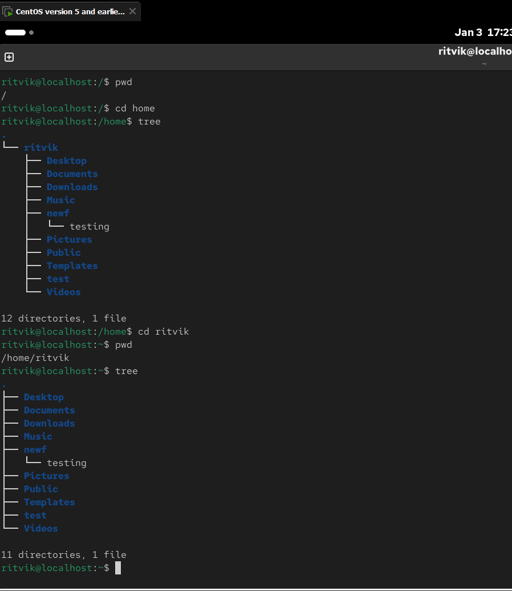

# Basic file structure of Linux 

### 1. The Office Building (The File System)
In Windows, you have different "disks" (C drive, D drive). In Linux, there is only one building starting at the ground floor called Root (/).

The Lobby (/): This is the entrance. You can see everything from here, but you can't touch much.

The Utility Room (/etc): This is where the building’s "settings" are (the light switches and thermostat).

The Staff Room (/bin): This is where the "tools" are kept (hammers, screwdrivers, or in computer terms, the ls and cp commands).

The Apartments (/home): This is where the people live. Each person has their own private room.

### 2. Your "Room" (ritvik@localhost:~$)
When you see ritvik@localhost:~$, it means you are currently sitting inside your own private room.

ritvik: That's you.

~ (The Tilde): This is the nickname for your room. It's much easier to type ~ than the full address /home/ritvik.

$: This means you are a regular resident. You can move the furniture in your own room (~), but you can't go into the Utility Room (/etc) and change the building's wiring unless you use a "Master Key."

### File structue diagram

/ (The Root - The Trunk of the Tree)
├── bin       (Common commands like 'ls', 'cp', 'mkdir')
├── sbin      (System commands for administration)
├── etc       (System-wide Configuration files - "The Settings")
├── home      (User personal folders)
│   ├── ritvik  (<-- This is where you are (~))
│   └── guest
├── root      (Home folder for the Superuser/Admin)
├── var       (Variable data like System Logs)
├── tmp       (Temporary files - cleared on restart)
├── dev       (Hardware devices like hard drives, mouse)
├── media     (Removable media like USB drives)
└── usr       (User programs and libraries)

