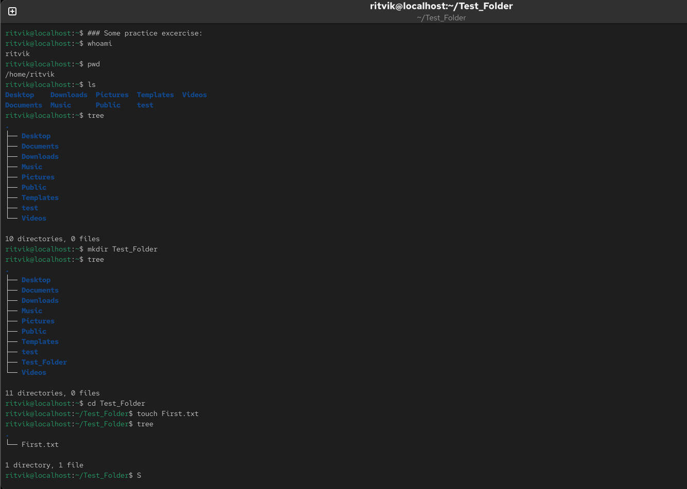
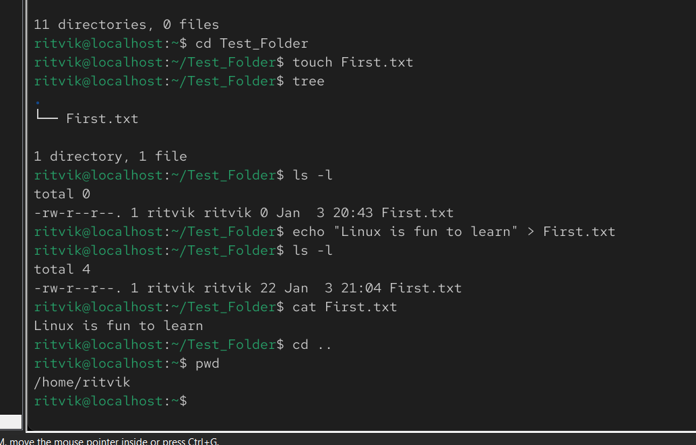

# Basic file structure of Linux 

### 1. The Office Building (The File System)
In Windows, you have different "disks" (C drive, D drive). In Linux, there is only one building starting at the ground floor called Root (/).

The Lobby (/): This is the entrance. You can see everything from here, but you can't touch much.

The Utility Room (/etc): This is where the building’s "settings" are (the light switches and thermostat).

The Staff Room (/bin): This is where the "tools" are kept (hammers, screwdrivers, or in computer terms, the ls and cp commands).

The Apartments (/home): This is where the people live. Each person has their own private room.

### 2. Your "Room" (ritvik@localhost:~$)
When you see ritvik@localhost:~$, it means you are currently sitting inside your own private room.

ritvik: That's you.

~ (The Tilde): This is the nickname for your room. It's much easier to type ~ than the full address /home/ritvik.

$: This means you are a regular resident. You can move the furniture in your own room (~), but you can't go into the Utility Room (/etc) and change the building's wiring unless you use a "Master Key."

### Basic practice exercises 1-

1. To get to know who is the user- "whoami"
2. To know the current location/working directory - "pwd"
3. to list all directories - "ls"
4. To list all directories in tree formate- "tree"
5. To create a new direcotry- "mkdri Folder_name" 
6. To move in that folder or any "cd folder name" or "cd path of the folder along witn folder name"
7. To add a text file under the new foder - "touch First.txt"

### Output

### Basic practice exercises 2-

8. To verify that you made the text file- "ls -l"- It gives the file details along with date and time
9. To write something in the file (Without any editor) - echo "Learning Linux is fun" > First.txt
10. Check the contents without opening an editor- "cat first_note.txt"
11. To go one step back in file hirarchy- "cd .."

### Output

12. Copy file to new desitnation- "cp <source> <Destination>"
13. move/rename a file - 

