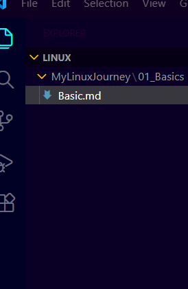

#1. Core Philosophy & Architecture"Everything is a file": 
This is the golden rule. Hardware (hard drives, mouse), directories, and running processes are all represented as files in the system.The Kernel: The heart of the OS. It manages the hardware (CPU, RAM, Disks) and acts as a bridge between software and hardware.The Shell (Bash): A command-line interpreter. It’s the program that takes your typed commands and passes them to the Kernel.Distributions (Distros): Linux is just the kernel. Ubuntu is a "Distro" that adds a user interface, package manager, and pre-installed tools.
#2. The Linux File System (FHS)Unlike Windows (C:\), Linux starts at the Root (/)./ : 
The root directory (top level)./bin : Essential binary executables (e.g., ls, cp)./etc : System configuration files (where DevOps lives!)./home : User personal folders (e.g., /home/yourname)./root : The home directory for the Superuser (Admin)./var/log : Where system logs are kept (crucial for troubleshooting)./tmp : Temporary files (cleared on reboot).
#3. Essential Command Categories
A. Navigation & InformationCommandWhat it doespwdPrint Working Directory (Where am I?)ls -laList files (including hidden ones -a and details -l)cd ..Move up one directory levelwhoamiDisplays the current logged-in user

